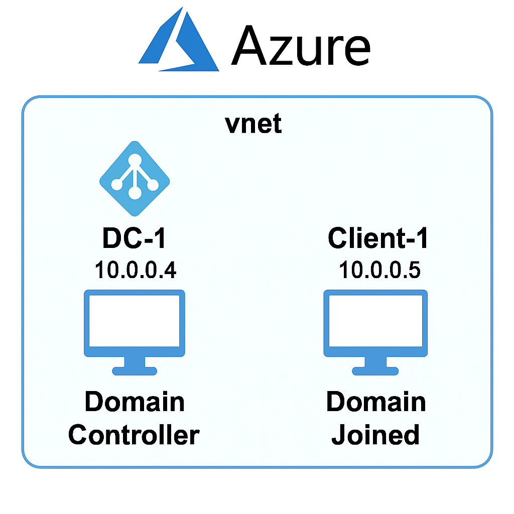
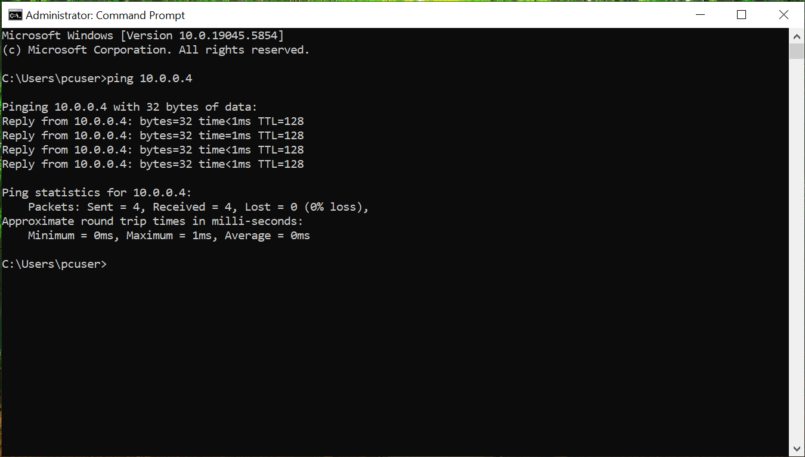
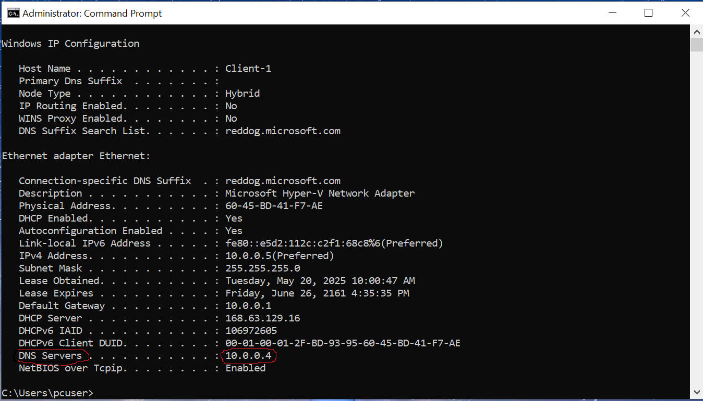
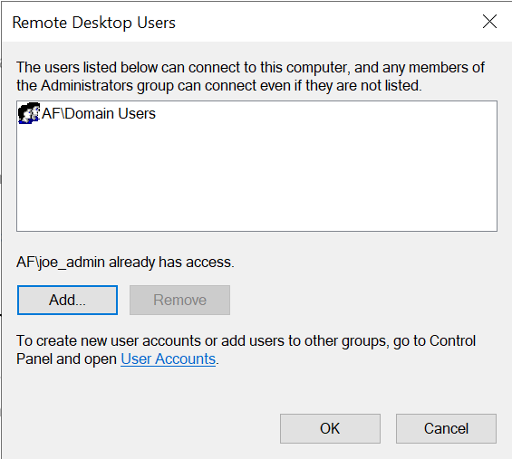

<div align=center>
  
</div>

<br>

# Deploy Active Directory in Azure

This project showcases the setup of a Windows Server Active Directory environment on Microsoft Azure. It involves deploying a Domain Controller (DC) and a Client (PC), joining the client to the domain, creating user accounts, and ensuring the user accounts can log on successfully with proper connectivity and remote access.

## Technologies Used
- Microsoft Azure
- Windows Server 2022
- Windows 10 Pro
- Active Directory Domain Services
- PowerShell
- RDP

## Architecture
- **Virtual Network**: 10.0.0.0/16
- **DC-1**: Windows Server 2019 (Domain Controller)
- **Client-1**: Windows 10 Pro (Domain Joined)
<br>
<div align=center>
  
</div>

---

## Provisioning Resources in Azure

1. **Create Domain Controller VM**
   - Name: `DC-1`
   - OS: Windows Server 2022
   - Create a new or use existing Resource Group and Virtual Network (VNet)
   - Ensure RDP (port 3389) is allowed in the NSG

2. **Set DC-1’s Private IP to Static**
   - Go to **Azure Portal** > **DC-1 VM** > **Networking** > **Network Interface** > **IP Configurations**
   - Set Private IP address assignment to **Static**
   - Save the configuration

3. **Create Client VM**
   - Name: `Client-1`
   - OS: Windows 10
   - Use the same Resource Group and VNet as `DC-1`
   - Confirm both VMs are in the same VNet (verify using Network Watcher)

<br>

## Verify Network Connectivity 
  - Enable ICMP on Both VMs by opening **PowerShell** as *Administrator* and running:
     ```powershell
     Enable-NetFirewallRule -DisplayName "File and Printer Sharing (Echo Request - ICMPv4-In)"
     ```
  - On `Client-1`, open **Command Prompt** and run: `ping <DC-1 IP>`
  - Verify that the ping replies are successful, confirming network connectivity



<br>

## Set Up Active Directory

1. **Install Active Directory Domain Services (AD DS)**
   - Ensure `DC-1`’s IP is set to **Static** (see *Step 2* in **Provisioning Resources in Azure** if needed).
   - Open **PowerShell** as *Administrator* on `DC-1` and run:
     ```powershell
     Install-WindowsFeature -Name AD-Domain-Services -IncludeManagementTools
     ```

3. **Promote DC-1 to Domain Controller**
   - Run the following command to create a new forest:
     ```powershell
     Install-ADDSForest
     ```
   - Specify a domain name of your choice (e.g., `lab.mydomain.com`)
   - When prompted, enter and confirm the password
   - Type `y` and press Enter to begin the promotion
   - After the promotion is done, the system will reboot. Log back in to continue

**Note:** For internal Active Directory setups, it's best to use a registered domain with a subdomain prefix (e.g., `lab.mydomain.com`) to avoid DNS conflicts and ensure proper management. If you don’t have a domain, you could use TLDs that are reserved for testing purposes like `lab.test`.

When **Active Directory** is installed on `DC-1`, the **DNS role** is added as well. `DC-1` will function as both the **Domain Controller** and **DNS server** for `Client-1`. Later in the lab, we’ll configure `Client-1`’s DNS settings to point to `DC-1` for domain resolution.

<br>

## Create a Domain Admin User

1. **Create Organizational Units (OUs)**
   - Open **Active Directory Users and Computers** (ADUC)
   - Create `_EMPLOYEES` OU
   - Create `_ADMINS` OU

2. **Create a Domain Admin User**
   - Right-click `_ADMINS` > **New** > **User**
   - Create a user (e.g., `joe_admin`)
   - Set a secure password
   - Uncheck “User must change password at next logon”

**Important:** For this lab environment, uncheck this option because Remote Desktop (RDP) does not allow users to change their password during the first login. In production environments, this setting should remain checked for security best practices.

3. **Assign Administrative Rights**
   - Add the new user to `Domain Admins` group
   - Log out of the current session
   - Log in as `mydomain.com\joe_admin`
> If your domain has a prefix like `lab.mydomain.com`, you can log in using the short form `lab\joe_admin` instead of the full domain name.

<br>

## Join Client-1 to the Domain

1. **DNS Configuration**
   - In **Azure Portal** > **Client-1 VM** > **Networking** > **Network Interface** > **DNS servers**
   - Set **DNS servers** to **Custom** and enter the static IP of `DC-1`
   - Restart `Client-1` from the Azure Portal

2. **Verify DNS Settings**
   - Open **Command Prompt** on `Client-1`
   - Run: `ipconfig /all`
   - Confirm DNS points to the private IP of `DC-1`



3. **Join Client-1 to Domain**
   - Go to **Settings** > **System** > **About**, then click **Rename this PC (Advanced)**.
   - Click Change, enter the domain (e.g., lab.mydomain.com)
   - Use domain admin credentials when prompted
   - Restart when prompted. `Client-1` is now part of the domain

<br>

## Create Standard User Accounts

1. **Create Users via PowerShell**
   - Open **PowerShell** as domain admin on `DC-1` and run:
     ```powershell
      Import-Module ActiveDirectory

      # Define variables
      $firstName = "Joe"
      $lastName = "Doe"
      $fullname = "$firstName $lastName"
      $username = "joe_doe"
      $password = ConvertTo-SecureString "P@ssw0rd123" -AsPlainText -Force
      
      # Create AD user
      New-ADUser `
        -GivenName $firstName `
        -Surname $lastName `
        -Name $fullname `
        -SamAccountName $username `
        -AccountPassword $password `
        -PasswordNeverExpires $true `
        -Enabled $true `
        -Path "OU=_EMPLOYEES,$(([ADSI]'').distinguishedName)"

     ```
> Feel free to replace the sample variable values with your own user information to fit your environment.

<div align="center">
  
  
</div>

<br>

2. **Enable RDP Access for Standard Users**
   - On `Client-1`, right-click **Start** > **System** > **Remote Desktop**
   - Click “Select users that can remotely access this PC”
   - Add the `Domain Users` group and click **OK** to apply changes



3. **Verify Logon via Remote Desktop**
   - Open **Remote Desktop Connection** and connect to `Client-1`
   - Login as the standard user (e.g., `mydomain\joe_doe`)
   - Make sure the login is successful

---

## Acknowledgments

This lab project was inspired by the **Active Directory** lab concept from **CourseCareers**’ Information Technology course. The implementation is my own and was developed using freely available resources.
